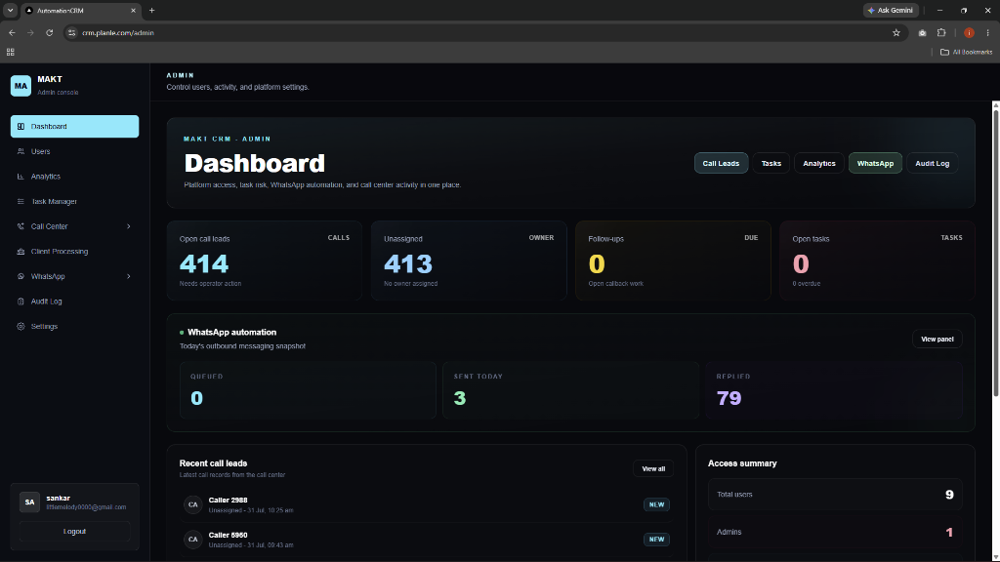

# CRM & Sales Automation Platform

[](https://crm.planle.com/admin)
[](https://nextjs.org/)
[](https://www.prisma.io/)
[](https://www.typescriptlang.org/)

Full-stack CRM and sales automation platform featuring WhatsApp messaging automation, call tracking, lead distribution, real-time analytics, audit logging, and Google Sheets synchronization.

---

## 🌐 Live Application

Access the live admin console here:  
👉 **[https://crm.planle.com/admin](https://crm.planle.com/admin)**

---

## 📸 Dashboard Preview



---

## 🚀 Core Features

- 💬 **WhatsApp Automation Engine**:
  - Multi-account rotators with anti-ban safeguards.
  - Automated outbound messaging queue with worker process (`whatsapp-worker.mjs`).
  - Interactive Inbox, Outbox, and message variant editors.

- 📞 **Call Center & Lead Tracking**:
  - Live call tracker integration with heartbeat and registration endpoints.
  - Missed call callback queues, owner lead claiming, and follow-up management.
  - Company phone badges and operator activity feeds.

- 📊 **Analytics & Audit Logging**:
  - Real-time dashboard statistics for leads, tasks, and outbound messaging.
  - Comprehensive Audit Log tracking user actions and security events.

- 🔒 **Security & Access Control**:
  - Role-based permissions (Admin & Standard User).
  - Password policy enforcement, login attempt rate-limiting, and session token rotation.

- 🔄 **Google Sheets Synchronization**:
  - Automated lead ingestion via Google Apps Script webhooks.

---

## 🛠️ Tech Stack

- **Framework**: Next.js 16 (App Router) & React 19
- **Language**: TypeScript
- **Database & ORM**: PostgreSQL with Prisma ORM
- **Automation Worker**: WhatsApp Web JS (`whatsapp-web.js`)
- **Styling & UI**: TailwindCSS, Recharts, Framer Motion
- **Testing & Quality**: Vitest & ESLint

---

## 💻 Local Setup & Development

### Prerequisites
- Node.js 20+
- PostgreSQL database

### 1. Environment Configuration
Copy `.env.example` to `.env` and set your credentials:

```bash
cp .env.example .env
```

Required environment variables:
- `DATABASE_URL`: PostgreSQL connection string.
- `AUTH_SECRET`: Random session signing secret (min 32 characters).
- `ADMIN_USERNAME`, `ADMIN_EMAIL`, `ADMIN_PASSWORD`: Used for initial admin seeding.

### 2. Install & Initialize
```bash
# Install dependencies
npm install

# Generate Prisma Client & Run Migrations
npm run prisma:generate
npm run prisma:migrate

# Seed Initial Admin Account
npm run seed:admin

# Start Development Server (Next.js + WhatsApp Worker)
npm run dev
```

Open [http://localhost:3000](http://localhost:3000) in your browser.

---

## 🚢 Production Deployment

Run pre-flight checks:
```bash
npm run check
```

Apply migrations to production database:
```bash
npm run prisma:deploy
```

Start production services with PM2:
```bash
npm run start:prod
```

---

## 📜 License

Private & Proprietary — All Rights Reserved.
